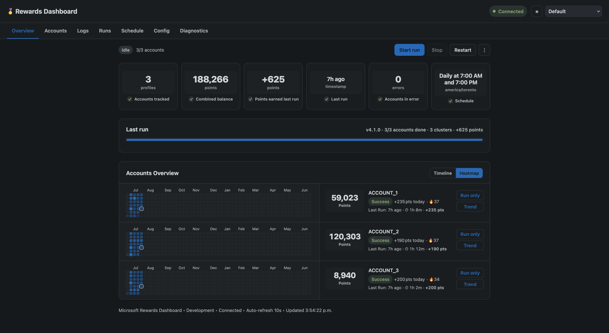
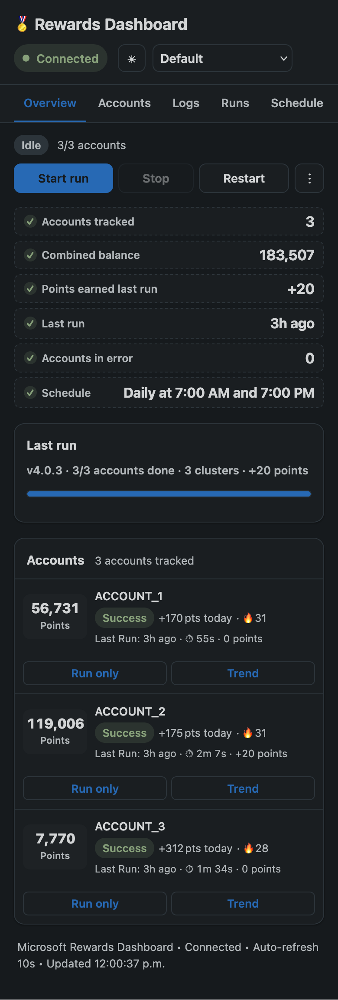

# Rewards Dashboard

A companion dashboard for [microsoft-rewards-script](https://github.com/thenetsky/microsoft-rewards-script), driven entirely over HTTP by the bot's [Control API](https://github.com/thenetsky/microsoft-rewards-script/tree/v4/scripts/api) (`API_MODE=true`). It shows account status, point totals, and trends at `http://<host-ip>:8890`, and can start/stop/schedule runs and edit the bot's config.

> [!WARNING]
> In active development to support the microsoft-rewards-script new API features. 

## Screenshots

| Desktop | Mobile |
| --- | --- |
|  |  |

## Features
- **Local only** - all data is stored locally, your account data is your own.
- **Account overview** — points per account, run status, and error highlights
- **Point accumulation bars** — see trends and errors at a glance with daily blocks per account, with weekly dividers; hover for exact date/points/total
- **Passwordless codes** — displays passwordless two-digit codes with a live 60-second countdown so you never miss them in the logs
- **History** — parsed events stored in a local SQLite db so data survives restarts, independent of the bot's own in-memory log buffer
- **Theme support** — Includes themes: Nord, Dracula, Catppuccin, Gruvbox, Tokyo Night, and more!
- **Responsive** - Features a simplified mobile view

## Quick start (Docker)

1. On the bot side, enable the Control API — set `API_MODE=true` and `API_TOKEN=<some-long-random-string>` on the `microsoft-rewards-script` service, and expose port `3010`.

> [!TIP]
> Also enable the `API_ALLOW_SCHEDULE_WRITE` and `API_ALLOW__CONFIG_WRITE` on the script side to allow the dashboard to modify the script's config and scheduler.

2. Review this repo's `compose.yaml` and set `CONTROL_API_TOKEN` (in a `.env` file next to it) to that same token.
3. Build and start the container: `docker compose up -d`.
4. Visit the dash at `http://<host-ip>:8890`.

> [!WARNING]
> Both services need to share a Docker network so the dashboard can reach the Control API by container name. 
> The easiest way to do this is copy the full rewards-dashboard service into your script's compose.yaml. See [sample-stack-compose.yaml](sample-stack-compose.yaml)
> Alternatively, create a docker network (e..g, `rewards`), and add the following to both the script and the dash compose.yaml

```yaml
  networks:
    - rewards

networks:
  rewards:
    driver: bridge
    external: true

```

## Quick start (Bare metal)
Requires Node 22.13+ (uses the built-in `node:sqlite`). Zero npm packages.

```bash
# in the bot repo
API_TOKEN=some-long-random-string node scripts/api/server.js
```

Then point the dashboard at it - `CONTROL_API_TOKEN` must equal the API's `API_TOKEN`:

```bash
cp .env.example .env      # edit CONTROL_API_URL + CONTROL_API_TOKEN
npm start                 # http://localhost:8890
```

## Authentication
Dashboard login protection is configured separately with `DASHBOARD_USERNAME`
and `DASHBOARD_PASSWORD`. Basic authentication is enabled only when both values
are non-empty. Leave either one empty to open the dashboard without a browser
login prompt. This does not disable authentication between the dashboard and the
Control API; `CONTROL_API_TOKEN` still needs to match the API's `API_TOKEN`.


## Optional API flags

Two features are gated on the _API_ side, and are off by default:

| Set on the Control API         | What it unlocks                                                                                                       |
| ------------------------------ | --------------------------------------------------------------------------------------------------------------------- |
| `API_ALLOW_CONFIG_WRITE=true`  | The **Config** tab can save changes. Without it, config is read-only and saving returns a 403 (the tab tells you so). |
| `API_ALLOW_CONFIG_REVEAL=true` | The **Config** tab's "reveal secrets" toggle. Without it, webhook URLs and tokens stay `***REDACTED***`.              |

---

## Tabs

**Overview** - stat cards (accounts, combined balance, last run, accounts in error, next scheduled run), a live run panel with a progress bar and per-account rows while the bot is working, and a recent-activity feed.

**Accounts** - every configured account, joined with what the logs actually observed: current balance, daily accumulation bars, today's gain, success/error state, current streak, streak protection status and remaining protection days, and a details drawer (slot, geo, language, TOTP, recovery email, proxy, lifetime collected). Accounts live in the bot's `.env`, so this tab reports on them rather than editing them.

**Logs** - live log viewer over SSE. Level filter, text search, pause (buffers while paused), autoscroll, load-more, download, clear.

**Runs** - points collected per day (14/30/90-day views) plus a run history table, and a collapsible list of process exits pulled from the API - which catches crashes that never made it to a `RUN-END` line. A run that dies mid-flight is closed out and marked **Crashed** with its exit code, instead of sitting at "running" forever.

**Schedule** - the dashboard's own cron. Presets, a live-validated cron field with a plain-English description, account exclusions, missed-run recovery, "skip if already running", next/last run times and the last result. It's stored in the dashboard's database and fires a run by pressing Start on the API for you.

**Config** - the bot's `config.json`. Quick toggles for the common booleans, plus a raw JSON editor. Saving sends a **PATCH of only the fields you changed**, never a full document - so the redacted webhook secrets in your view can't be written over the real ones. If you do edit a redacted field, the save is refused with an explanation. Validation errors from the bot's own validator come back inline.

**Diagnostics** - the bot's error captures. Error text, screenshot, and the HTML dump, streamed through the dashboard.

Above the tabs, a control strip is always visible: **Start**, **Stop**, **Restart**, and behind the ⋮ menu, **Force stop** and **Shut down API**. Login approval codes appear at the top of the page the moment they show up in the logs, with a countdown.

---

## How it works

**One SSE connection, fanned out.** The server holds a single event stream to the Control API and broadcasts to every open tab (`lib/eventHub.js`), with `Last-Event-ID` resume and reconnect backoff. Ten tabs open still means one connection to the bot.

**Two data paths.** Log lines go to the browser live, _and_ through the parser into SQLite (`lib/store.js`). The API keeps a 2,000-line in-memory buffer that dies with the process; the dashboard's point history, run records, activity and schedule survive restarts of both.

**Live points.** The bot prints its balance and every gain as it earns them, and the API folds those lines into a running tally (`GET /points`). So the Overview shows points climbing _during_ a run, not just the final total. When an account finishes, the live tally is replaced by the authoritative `ACCOUNT-END` numbers.

**Separate authentication layers.** `CONTROL_API_TOKEN` is sent only from the dashboard to the Control API as a Bearer token and must match the API's `API_TOKEN`. Browser access uses the optional `DASHBOARD_USERNAME` and `DASHBOARD_PASSWORD` pair instead.

**No dependencies.** Charts are hand-rolled inline SVG (`public/charts.js`) that read their colors from CSS variables, so they follow the theme and work offline. The 14 themes from the original dashboard are untouched.

---

## Environment

| Variable              | Default                                |                                                                                           |
| --------------------- | -------------------------------------- | ----------------------------------------------------------------------------------------- |
| `CONTROL_API_URL`     | `http://microsoft-rewards-script:3010` | Where the Control API listens                                                             |
| `CONTROL_API_TOKEN`   | -                                      | Bearer token sent to the Control API; must match the API's `API_TOKEN`                    |
| `DASHBOARD_USERNAME`  | -                                      | Optional Basic-auth username; auth is enabled only when username and password are set     |
| `DASHBOARD_PASSWORD`  | -                                      | Optional Basic-auth password; leave either dashboard credential empty to disable login    |
| `PORT`                | `8890`                                 |                                                                                           |
| `TZ`                  | `UTC`                                  | Buckets points into days - set it                                                         |
| `DASHBOARD_TITLE`     | `Microsoft Rewards`                    | Header title                                                                              |
| `POLL_MS`             | `5000`                                 | Status poll interval (logs are streamed)                                                  |
| `LOG_REPLAY`          | `300`                                  | Log lines to replay when the stream connects                                              |
| `DATA_DIR`            | `./data`                               | Where `dashboard.sqlite` lives - the only folder anything writes to. Docker sets `/data`. |

---

## Troubleshooting

**"Control API unreachable"** - the dashboard can't open a TCP connection. Check `CONTROL_API_URL`. In Docker, `localhost` means the dashboard's own container: use the API's service name, or `host.docker.internal` with `extra_hosts`.

**"Control API rejected our token"** - `CONTROL_API_TOKEN` ≠ `API_TOKEN`.

**Browser login prompt does not appear** - both `DASHBOARD_USERNAME` and `DASHBOARD_PASSWORD` must be non-empty. Authentication is intentionally disabled when either value is empty.

**Saving config returns 403** - the API was started without `API_ALLOW_CONFIG_WRITE=true`.

**Daily bars roll over at the wrong time** - `TZ` isn't set.

**A scheduled run didn't fire** - check the Schedule tab's missed-run policy, excluded accounts, and "Last result".

## Support

If you've found this project helpful and would like to support further development, please consider donating. Thank you:

[](https://www.paypal.com/cgi-bin/webscr?cmd=_donations&business=R4QX73RWYB3ZA)
[](https://liberapay.com/cammarata.m/)
[](https://www.ko-fi.com/mgrimace)
[](https://www.buymeacoffee.com/cammaratam)
